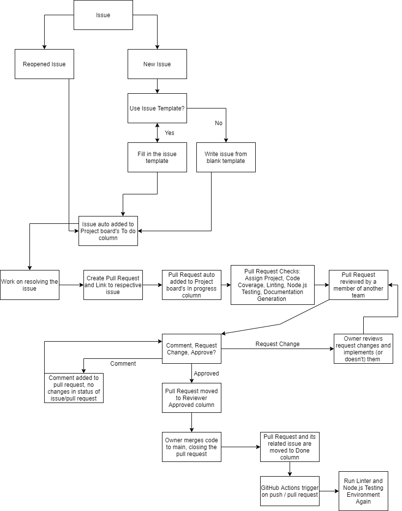

# CI/CD Pipeline Phase 1

## Current Functionality

The CI/CD pipeline is currently able to auto-assign issues/pull requests to the project board, lint code, enforce code style, check code quality via tool, check code quality via human review (pull requests), generate documentation, and automate testing

- Auto-assign issues/pull requests to project board
  - Created project board
    - Enabled automation for the columns: To do, In progress, Reviewer approved, Done
    - Issues are placed in To do
    - Pull requests are placed in In progress
    - Approval of pull requests moves them to Reviewer approved
    - Issues and Pull Requests that are closed are moved to Done
- Linting and Code Style enforcement
  - Utilized GitHub's superlinter GitHub actions in the workflow in order to automate the linting and code style enforcement of any code that is pushed to main.
  - Badge from the Lint Code Base is shown on README.me.
- Code quality via tool
  - Utilized Codacy to check code quality in the repo.
  - Badge of code quality status is shown on README.me.
    - Grades range from F to A
- Code quality via human review
  - Setup teams in the organization and assigned team members to the correct role
    - Teams: Frontend, Backend, QA, UI/UX
  - Used branch protection on "main" in order to enforce pull request reviews
    - pull requests require 1 review from another team in order to be approved
    - checks from linting, documentation generation, and auto-assign must pass before being merged
    - administrator can override review requirement and force push
- Documentation Generation
  - Utilized JSDoc GitHub action in the workflow in order to automate the create of documentation from javascript files.
  - Documentation that is created is pushed to a separate repo under the same organization
    - GitHub Pages hosts the website for the documentation
- Automate Testing
  - Utilized end-to-end testing, through jest/puppeteer, in order to test the functionality of our webpage
  - Tests located in "__tests__" folder
  - Unit testing clashed with our firebase imports, could not resolve
  - GitHub actions workflow file has been enabled and it installs 3 Node.js versions and run the tests that are defined in the "__tests__" folder on each version
- Code Coverage
  - Utilized Codeacy's built in code coverage tool

## In progress
- Testing
  - Continue to write more tests as functionality of the webpage is finalized and comes to the final product

## Diagram of Pipeline

